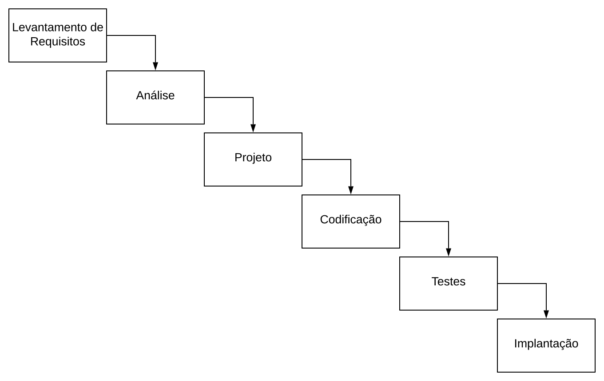
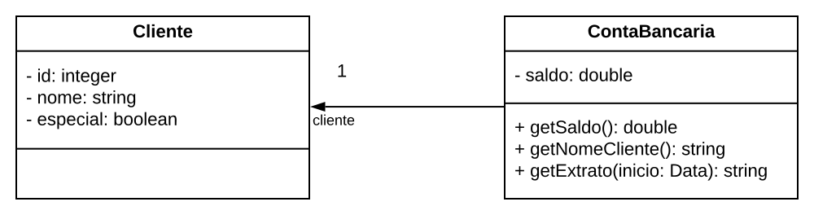

<!-- _paginate: false -->
# **Engenharia de Software**

## Capítulo 1 - Introdução

---

## Livro-texto

Slides baseados no conteúdo do livro **Engenharia de Software Moderna** de Marco Tulio Valente
ISBN: 978-65-00-01950-6
Site: https://engsoftmoderna.info

---

## Introdução

- No mundo moderno, tudo é software
- Investigar os desafios e propor soluções que permitam desenvolver software (complexo) de forma produtiva e com qualidade

---

## Definição

- Aplicação de abordagens sistemáticas, disciplinadas e quantificáveis para desenvolver, operar, manter e evoluir software;
- Se preocupa em propor e aplicar princípios de engenharia na construção de software

---

## O que já sabemos?

- Hoje já se tem conhecimento que software (na maioria das vezes) não deve ser construído de forma sequencial como ocorre na Eng. Civil, Mecânica e Eletrônica
- Técnicas de testes devem ser usadas para garantir que os sistemas em construção tenham qualidade e que falhas não ocorram em produção
- Sistemas envelhecem, como outros produtos de engenharia, logo precisam de manutenção corretiva e que fiquem fáceis de manter e entender

---

## Dificuldades em desenvolvimento de software

- Essenciais - São da natureza da área
  - Complexidade: complexidade inerente a sua área. Ex.: software de satélite, usina nuclear, avião, etc.
  - Conformidade: adaptar-se ao seu ambiente/mundo. Ex.: Leis de impostos que mudam

---

## Dificuldades em desenvolvimento de software

- Essenciais
  - Facilidade de mudanças: necessidade de evoluir, incorporando novas funcionalidades.
  Ex.: Adicionar a cobrança de um novo imposto 
  - Invisibilidade: dificuldade em estimar o tamanho e o esforço de construir um sistema de software.
  Ex.: construir um sistema de controle de foguetes

---

## Dificuldades em desenvolvimento de software

  - Acidentais: estão associadas a problemas tecnológicos.
  Ex.: compilador com mensagens de erro obscuras; IDE que trava; framework sem documentação; interface Web pouco intuitiva, etc.

---

## Áreas de conhecimento de Eng. de Software

- Engenharia de Requisitos
- Projeto de Software
- Construção de Software
- Testes de Software
- Manutenção de Software
- Gerência de Configuração
- Gerência de Projetos
- Processos de Software

---

## Áreas de conhecimento de Eng. de Software

- Modelos de Software
- Qualidade de Software
- Prática Profissional
- Aspectos Econômicos

---

## Engenharia de Requisitos

- Requisitos definem *o que* um sistema deve fazer e *como* ele deve operar. Podem ser funcionais e não-funcionais
  - Funcionais: definem *o que* o sistema deve fazer, isto é, quais funcionalidades e serviços ele deve implementar. Ex.: controle de estoque, cálculo de impostos, controle de localização de um foguete
  - Não-funcionais: definem *como* um sistema deve operar. Ex.: desempenho, disponibilidade, tolerância a falhas, segurança, privacidade, interoperabilidade, capacidade e usabilidade.

---

## Projeto de Software

- Define as principais unidades de código, no nível de interfaces (sem detalhes)
- Interfaces providas e requeridas
  - Providas: são aqueles serviços que uma unidade de código torna público para o uso pelo resto do sistema
  - Requeridas (ou dependências): são aquelas interfaces das quais uma unidade de código depende para funcionar

---

## Projeto de Software

- Exemplo:
  ```
  public class ContaBancaria {
    private Cliente cliente;
    private double saldo;
    public double getSaldo() {...}
    public String getNomeCliente() {...}
    public String getExtrato(Date inicio) {...}
  }
  ```
---

## Projeto de Software

- Arquitetura de software trata da organização de um sistema em um nível de abstração mais alto (pacotes) do que aquele que envolve classes ou construções semelhantes

---

## Construção de Software

- Trata da implementação (codificação) do sistema
- Define:
  - Algoritmos e estruturas de dados utilizadas
  - Frameworks e bibliotecas de terceiros
  - Técnicas de tratamento de exceções
  - Padrões de nomes, layout e documentação de código
  - Ferramental utilizado
    - IDE, compiladores, depuradores, SGBDs, etc.

---  

## Testes de Software

- Consiste na execução de um programa com um conjunto finito de casos, com o objetivo de verificar se ele possui o comportamento esperado
- Possui limitações:

  *"Testes de software mostram a presença de bugs, mas não a sua ausência"*  -- Edsger Dijkstra

---

## Testes de Software

- Tipos de testes
  - Testes de unidade
    - Testam uma classe
  - Testes de integração
    - Testam um conjunto de classes
  - Testes de performance
    - Testam o sistema sob uma carga de trabalho
  - Testes de usabilidade
    - Testam a usabilidade da interface de um sistema

---

## Testes de Software

- Verificação
  - Garantir que um sistema atende a especificação (estamos implementando o sistema corretamente?)
- Validação
  - Garantir que um sistema atenda às necessidades do cliente (estamos implementando o sistema correto?)

---

## Testes de Software

- Defeito, erro, falta (fault) e bug
```
if (condicao) {
  area = pi * raio * raio * raio;
}
```
- Falha
  - Código com defeito executado
  - Nem todo defeito ou bug ocasiona falhas

---

## Manutenção e Evolução de Software

- Corretiva
  - Corrige bugs reportados por usuários e desenvolvedores
  - Exemplo: código anterior
- Preventiva
  - Corrige bugs que ainda não causaram falhas
  - Exemplo: código anterior

---

## Manutenção e Evolução de Software

- Adaptativa
  - Adaptar um sistema a uma mudança em seu ambiente
  - Exemplos: Migração de Python 2.7 para 3.0, customização para cliente, mudança de legislação

---

## Manutenção e Evolução de Software

- Refactoring
  - Visa melhoria no código/projeto, visando preservar o comportamento
  - Exemplos: renomear método/variável, dividir um método em dois
- Evolutiva
  - Inclui uma nova funcionalidade ou aperfeiçoamentos importantes em funcionalidades existentes
  - Exemplo: Sistema bancário, adiciona controle de crédito/cartão

---

## Gerência de Configuração

- Define um conjunto de políticas para gerenciar as diversas versões de um sistema
  - Ferramental utilizado: git, subversion, mercurial, etc.
  - Versionamento semântico (x.y.z)

---

## Gerência de Projetos

- Desenvolver software requer práticas e atividades de gerência de projetos
  - Ex.: negociação de contratos, gerência de RH, gerência de riscos, acompanhamento da concorrência, marketing, finanças 
- Stakeholder
  - Todas as partes interessadas no projeto
  - Ex.: pessoas físicas, empresas, desenvolvedores, fornecedores, governo, etc. 

---

## Gerência de Projetos

- Lei de Brooks
  
  *"A inclusão de mais desenvolvedores em um projeto que está atrasado contribui para torná-lo ainda mais atrasado"* -- Frederick Brooks

---

## Processos de Desenvolvimento de Software

- Define quais atividades e etapas devem ser seguidas para construir e entregar um sistema de software
- Tipos
  - Waterfall (ou em cascata)
  - Ágeis (ou incrementais ou interativos)

---

## Processos de Desenvolvimento de Software

- Waterfall
  - Construção de um sistema deve ser feita em etapas sequenciais
  - Métodos
- Ágil
  - Construção de forma incremental e iterativa
  - Métodos: XP, Scrum, Kanban e Lean Development
---

## Processos de Desenvolvimento de Software



---

## Processos de Desenvolvimento de Software

- As metodologias ágeis ajudaram a disseminar diversas práticas
  - Testes automatizados
  - Test-Driven Development (TDD)
  - Integração Contínua (Continuous Integration)

---

## Modelos de Software

- Modelo é uma representação em mais alto nível de um sistema do que o código fonte
- Permite que desenvolvedores possam *abstrair* os detalhes e analisar propriedades e características essenciais de um sistema
- Notação mais utilizada: UML (Unified Modelling Language)

---

## Modelos de Software



---

## Qualidade de Software

- Qualidade externa
  - Considera fatores que pode ser aferidos sem olhar o código
  - Fatores: correção, robustez, eficiência, portabilidade, facilidade de uso, compatibilidade
- Qualidade interna
  - Considera propriedades e características relacionadas com a implementação de um sistema

---

## Qualidade de Software

- Métricas
  - Quantidade de linhas
  - Número de defeitos reportados
- Revisões de código
  - Outro desenvolvedor revisa o código antes de entrar em produção

---

## Prática Profissional

*"Engenheiros de Software devem se comprometer em fazer análise, especificação, projeto, desenvolvimento, teste e manutenção de software uma profissão benéfica e respeitada"*

---

## Aspectos Econômicos

- Questões econômicas se entrelaçam com o desenvolvimento de sistemas
  - Qual o modelo de rentabilização escolher?
  - Qual o preço será cobrado pela aplicação?
  - É melhor corrigir bugs ou adicionar novas features?

---

## Classificação de Sistemas de Software

- Sistemas A (Acute)
- Sistemas B (Business)
- Sistemas C (Casuals)


