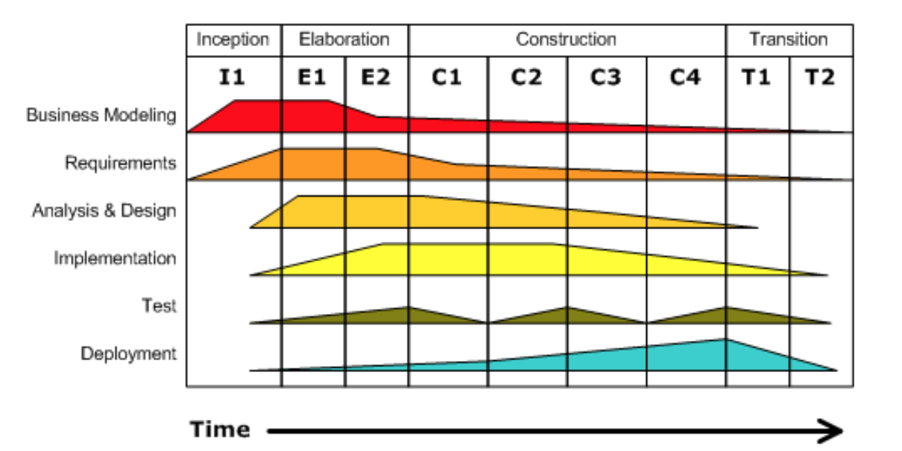

<!-- _paginate: false -->
# **Engenharia de Software**

## Capítulo 2 - Processos

---

## Livro-texto

Slides baseados no conteúdo do livro **Engenharia de Software Moderna** de Marco Tulio Valente
ISBN: 978-65-00-01950-6
Site: https://engsoftmoderna.info

---

## Introdução

- Software também é produzido de acordo com um processo
- Sistemas de software são complexos demais para serem desenvolvidos por uma única pessoa

---

## Processos

- Conjunto de passos, tarefas, eventos e práticas que se usa para construir software
- Empresas
  - Coordenam, motivam, organizam e avaliam o trabalho de seus desenvolvedores
- Desenvolvedores
  - Permitem que tomem consciência das tarefas e resultados que esperam deles

---

## Manifesto Ágil

- Software é diferente de produtos tradicionais de Engenharia
  - Requisitos mudam com frequência
  - Clientes não têm uma visão clara do que precisam
  - Documentos detalhados rapidamente tornam-se obsoletos
  
---

## Manifesto Ágil

- Adoção de **ciclos curtos e iterativos de desenvolvimento** por meio dos quais um sistema é implementado de forma gradativa, començando pelo que é mais urgente para o cliente
- Outras características
  - Menor ênfase em documentação
  - Menor ênfase em planos detalhados
  - Inexistência de uma fase dedicada a design
  - Desenvolvimento em times pequenos
  - Programação em pares, testes automatizados e int. contínua (CI)

---

## Manifesto Ágil

---

## Extreme Programming (XP)

- Conjunto de valores, princípios e práticas de desenvolvimento
- Valores
  - Comunicação, simplicidade, feedback, coragem, respeito e qualidade de vida
- Princípios
  - Humanidade, economicidade, benefícios mútuos, melhorias contínuas, falhas acontecem, baby steps e responsabilidade pessoal
  
---

## Extreme Programming (XP)

- Práticas sobre o processo de desenvolvimento
  - Representante dos clientes, histórias do usuário, iterações, releases, planejamento de releases, planejamento de iterações, planning poker e slack
- Práticas de programação
  - Design incremental, programação pareada, TDD, build automatizado e integração contínua
- Práticas de gerenciamento de projetos
  - Métricas, ambiente de trabalho e contrato com escopo aberto

---

## Valores de XP

- Comunicação
  - É importante para evitar e aprender com os erros
- Simplicidade
  - Em todo sistema complexo existem sistemas e subsistemas mais simples
- Feedback
  - Ajudam a controlar os riscos (mudança de requisitos, tecnologia, equipe, mundo, etc.)

---

## Princípios de XP

- Humanidade
  - O principal recurso de uma empresa de software são seus colaboradores
- Economicidade
  - Software tem que gerar resultados econômicos
- Benefícios Mútuos
  - Precisa beneficiar multiplos stakeholders

---

## Princípios de XP

- Falhas Acontecem
  - Falhas fazem parte do jogo e não devem ser usadas para punir membros de um time
- Melhorias Contínuas
  - O sistema deve ser continuamente aprimorado, a cada iteração, com o feedback dos clientes de todos os membros do time
- Baby Steps
  - Pequenas melhorias são melhores que grandes revoluções

---

## Princípios de XP

- Resonsabilidade Pessoal
  - Quem implementa uma história (requisito) é responsável por testá-la e mantê-la 
  
---

## Práticas do Proc. de Desenvolvimento de XP

- Envolvimento dos clientes com o projeto
- Representante dos clientes deve entender do domínio do sistema
  - Escreve as histórias de usuário (user stories)
  - Histórias são documentos simples, que focam na funcionalidade do sistema, na visão do usuário
  - Exemplo: *Um usuário logado no sistema, deve ser capaz de postas perguntas. Como é um site sobre programação, as perguntas podem incluir blocos de código, os quais devem ser representados por um leiaute diferenciado*

---

## Práticas do Proc. de Desenvolvimento de XP

- Os desenvolvedores definem quanto tempo será necessário para implementar as histórias escritas pelo representante dos clientes
- A duração de uma história é estimada em **story points** ao invés de horas ou homens/hora
  - Simples: 1 story point; 2x mais complexa, 2 story points, 3x...
- A implementação das histórias ocorre em **iterações**
  - Possuem duração fixa e bem definida (1 a 3 semanas)
- Iterações formam ciclos mais longos, chamados de **releases**

---

## Práticas do Proc. de Desenvolvimento de XP

- A **velocidade** de um time é o número de story points que ele consegue implementar em uma iteração
- **Planejamento de releases** é a tarefa de alocar histórias a iterações (2 a 3 semanas) e releases (alguns meses)
- **Planejamento da iteração** é decompor as histórias de uma iteração em tarefas (alguns dias)

---

## Práticas de Programação de XP

- Design Incremental
  - Atividade contínua e incremental, ao invés de concentrada no início do projeto
- Programação em Pares
  - Dois desenvolvedores trabalhando juntos, compartilhando o mesmo teclado e monitor
- Propriedade Coletiva do Código
  - Qualquer desenvolvedor pode modificar qualquer parte do código

---

## Práticas de Programação de XP

- Testes Automatizados
  - Programas (testes) para executar pequenas porções de um sistema e verificar se as saídas produzidas são as esperadas
- Desenvolvimento Dirigido por Testes (TDD)
  - Implementa-se primeiro o teste de um método e, só depois, o seu código
- Build Automatizado
  - Geração automatizada de uma versão do sistema que seja executável e que possa ser colocada em produção

---

## Práticas de Programação de XP

- Integração Contínua
  - Os desenvolvedores devem integrar seu código sempre, de preferência, antes da integração, fazer o build e executar os testes (**serviço de integração contínua**)

---

## Práticas de Gerenciamento de Projetos de XP

- Ambiente de Trabalho
  - Time pequeno; fixar cartazes nas paredes com o estado das históricas em cada iteração; jornadas de trabalho sustentáveis
- Contratos com Escopo Aberto
  - Pagamento por hora trabalhada
- Métricas de Processo
  - Duas métricas: número de bugs em produção e intervalo de tempo entre o início do desenvolvimento e o momento que o projeto começar a gerar seus primeiros resultados financeiros

---

## Scrum

- Scrum
  - Método ágil, iterativo e incremental para gerenciamento de projetos
    - Não necessariamente projetos de software
  - Papéis
    - Dono do produto, Scrum Master e Desenvolvedor
  - Artefatos
    - Backlog do Produto, Backlog do Sprint, Quadro Scrum, Gráfico de Burndown

---

## Scrum

- Scrum
  - Eventos
    - Planejamento do Sprint, Sprint, Reuniões Diárias, Revisão do Sprint e Retrospectiva

---

## Papéis do Scrum

- Dono do Produto (PO)
  - Deve possuir a visão do produto que será construído
  - Escrever as histórias de usuário
  - Tirar dúvidas do time
- Scrum Master (SM)
  - Especialista em Scrum do time
  - Responsável por garantir que as regras do método estão sendo seguidas

---

## Papéis do Scrum

- Desenvolvedor (DEV)
  - Especialista necessário para desenvolver o produto
  - Toma as decisões técnicas do projeto
  - Estima o tamanho das histórias (Story Points)

---

## Artefatos do Scrum

- Backlog do Produto
  - Lista de histórias ordenada por prioridades
- Backlog do Sprint
  - Artefato gerado ao final do Planejamento do Sprint
  - Lista de tarefas do sprint, bem como a duração das mesmas

---

## Artefatos do Scrum

- Quadro Scrum

---

## Artefatos do Scrum

- Gráfico de Burndown

---

## Eventos do Scrum

- Planejamento do Sprint
  - Reunião na qual todo o time se reúne para decidir as histórias que serão implementadas no sprint que vai se iniciar
  - Dividida em duas partes
    - A primeira, o PO propõe histórias para o sprint e o restante do time decide a velocidade (Story Points) para implementá-las
    - A segunda, os DEVs quebram as histórias e estimam a duração delas

---

## Eventos do Scrum

- Sprint
  - É uma iteração (de até um mês)
  - Ao final deve-se entregar um produto com valor tangível para o cliente
- Reuniões Diárias
  - Reunião de 15 minutos que todos devem participar
  - Cada membro deve responder: (1) O que fez no dia anterior; (2) o que pretende fazer hoje; (3) se está com algum impedimento na sua tarefa

---

## Eventos do Scrum

- Revisão do Sprint
  - Reunião para mostrar os resultados de um sprint
  - O PO pode aprovar todas as histórias do sprint ou caso apresente algum problema, pode voltar para o Backlog do Produto para ser retrabalhada em um próximo sprint
- Retrospectiva
  - Reunião com o time para refletir sobre o sprint qu está terminando e, se possível, detectar pontos de melhorias no processo, relacionamentos ou nas ferramentas utilizadas

---

## Scrum Time-box

- Todos os eventos do scrum têm uma duração bem definida

Evento                 | Time-box 
-----------------------|------------------
Planejamento do Sprint | máximo de 8 horas
Sprint                 | de até 1 mês
Reunião Diária         | de até 15 minutos
Revisão do Sprint      | máximo de 4 horas
Retrospectiva          | máximo de 3 horas

---

## Kanban

- Mais simples que Scrum
  - Não usa eventos, papéis ou artefatos, exceto o quadro de tarefas, conhecido como **Quadro Kanban**
  - O quadro é divido em colunas (e sub-colunas)
    - Primeira coluna é o backlog do produto (usuários escrevem histórias)
    - Demais colunas são os passos que devem ser seguidos (da esq. para direita) para transformar uma história de usuário em uma funcionalidade executável

---

## Kanban

---

## Limite Work in Progress (WIP) do Kanban

- Evitar que os times Kanban fiquem sobrecarregados
  - Soma-se a quantidade de linhas nas sub-colunas e estas não devem exceder o limite WIP 

---

## Cálculo do Limite WIP do Kanban

**WIP(passo) = ceil(TP * LT(passo))**

Em que:
ceil(): arredonda para cima
LT: lead time (tempo médio que uma tarefa fica em cada passo)
TP: throughtput do passo com maior lead time

- Exemplo:
TP = 8 tarefas / 21 dias (1 mês) = 0.38 tarefas / dia
LT(especificação) = 5 dias (supondo em média)
WIP(especificação) = ceil(TP * LT) = ceil(0.38 * 5) = ceil(1.9) = 2

---

## Quando não Usar Métodos Ágeis

- Design Incremental
  - Se o time não tem visão do design do sistema, se o domínio é novo e complexo ou o custo de mudanças futuras é alto
  - Exemplo: sistema de controle de foguetes
- Histórias de Usuário
  - Se for mportante ter uma especificação detalhada de requisitos no início do projeto, principalmente se for uma área nova
  - Exemplo: sistema de apólices de seguros
  
---

## Quando não Usar Métodos Ágeis

- Envolvimento do Cliente
  - Se os requisitos são estáveis e de pleno conhecimento do time de desenvolvedores
  - Exemplo: compilador de uma linguagem conhecida
- Documentação Leve e Simplificada
  - Em certos domínios, documentações detalhadas e de projeto são mandatórias
  - Exemplo: sistemas da área médica ou de transportes

---

## Quando não Usar Métodos Ágeis

- Times Auto-Organizáveis
  - Pode ser incompatível com os valores e cultura de certas organizações
  - Exemplo: IBM
- Contratos com Escopo Aberto
  - Algumas organizações podem não se sentir seguras para assinar esse tipo de contrato
  - Exemplo: algumas empresas da área de construção civil

---

# Outros Métodos Iterativos

- Modelo em Espiral

---

# Outros Métodos Iterativos

- Processo Unificado (UP) ou (RUP)
  - Baseado na linguagem UML
  - Fases
    - Inception: análise de viabilidade e riscos, escopo e orçamento
    - Elaboração: esp. de requisitos; definição da arquitetura
    - Construção: implementação do sistema e testes
    - Transição: disponibilização do sistema para produção

---

## Processo Unificado (UP) ou (RUP)

---

## Processo Unificado (UP) ou (RUP)

