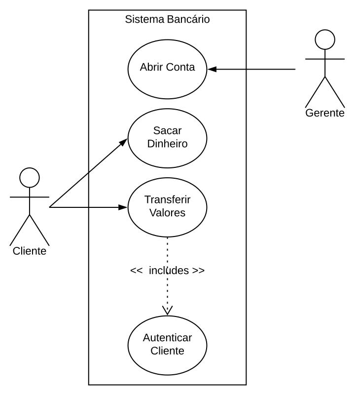
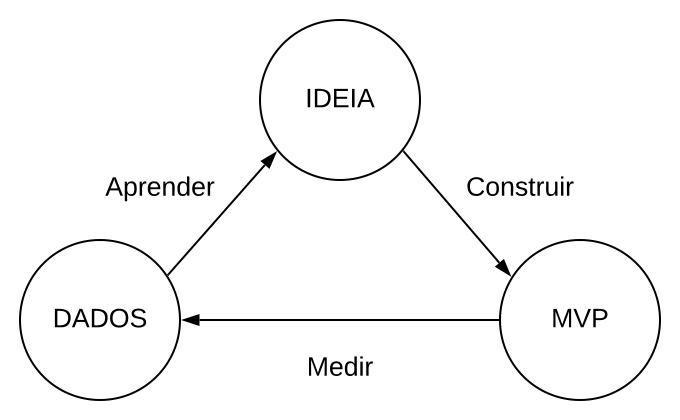

<!-- _paginate: false -->
# **Engenharia de Software**

## Capítulo 3 - Requisitos

---

## Livro-texto

Slides baseados no conteúdo do livro **Engenharia de Software Moderna** de Marco Tulio Valente
ISBN: 978-65-00-01950-6
Site: https://engsoftmoderna.info

---

## Introdução

- **Requisitos** definem *o que um sistema deve fazer* e *sob quais restrições*
  - *O que um sistema deve fazer*: **Requisitos Funcionais**
    - Exemplos: saldo, extrato, transferência, pagar um boleto, etc.
  - *Sob quais restrições*: **Requisitos Não-Funcionais**
    - Exemplos: desempenho, disponibilidade, segurança, consumo de memória e disco, etc.
- Definição dos requisitos é uma etapa crucial da construção de qualquer sistema de software

---

## Introdução

- **Requisitos de usuário**
  - Requisitos de mais alto nível, escrito por usuários em linguagem natural, sem detalhes técnicos
  - Mais perto do problema
  - Exemplo: "O sistema deve permitir transferências de valores para uma conta corrente por meio de TEDs"

---

## Introdução

- **Requisitos de sistema**
  - Requisitos técnicos, precisos e escritos pelos próprios DEVs
  - Mais perto da solução
  - Exemplo: protocolo a ser usado para realização das transferências

---

## Engenharia de Requisitos

- Conjunto de atividades relacionadas com a descoberta, análise, especificação e manutenção dos requisitos de um sistema
- **Elicitação de Requisitos** são atividades relacionadas com a descoberta e entendimento dos requisitos
- No desenvolvimento ágil, a documentação dos requisitos é feita de forma simplificada, por meio de **histórias de usuário**
- Mas em alguns projetos ainda se exige um **Documento de Especificação de Requisitos**, no qual todos requisitos são documentados em linguagem natural

---

## Engenharia de Requisitos

- Após sua especificação, os requisitos devem ser verificados e validados
  - Requisitos devem estar **corretos**
    - Exemplo: fórmula correta da remuneração da poupança
  - Requisitos devem ser **precisos**
    - Exemplo: 60 pontos no semestre ou 60 pontos no Exame Final e ser frequente
  - Requisitos devem ser **completos**
    - Não pode esquecer de especificar certos requisitos

---

## Engenharia de Requisitos

- Após sua especificação, os requisitos devem ser verificados e validados
  - Requisitos devem ser **consistentes**
    - Exemplo: um stakeholder diz que a disponibilidade é de 99,9% e outro 90%
  - Requisitos devem ser **verificáveis**
    - Exemplo: como verificar que um sistema deve ser amigável?

---

## Engenharia de Requisitos

- Requisitos devem ser priorizados
- Requisitos podem mudar, pois o mundo muda
- **Rastreabilidade** é a capacidade de dado um trecho de código, identificar os requisitos implementados por ele e vice-versa

---

## Histórias de Usuários

- Documentos simplificados de especificação de requisitos
- História de Usuário = Cartão + Conversas + Confirmação
- **Cartão:** contém escrita em poucas sentenças uma funcionalidade que esperam ver implementada no sistema
- **Conversas:** entre clientes e DEVs, por meio das quais os clientes explicam e detalham o que escreveram no cartão
- **Confirmação (Testes de aceitação):** teste de alto nível para verificar se uma história foi implementada conforme o esperado

---

## Boas Histórias Devem Ser INVEST

- **I**ndependentes: dadas duas histórias X e Y, deve ser possível implementá-las em qualquer ordem
- **N**egociável: DEVs devem estar abertos a implementar detalhes que não estão expressos e clientes devem aceitar argumentos técnicos sobre inviabilidade
- **V**aliosa: histórias são propostas, escritas e priorizadas pelos clientes de acordo com o valor que agregam ao negócio
- **E**stimável: deve ser viável estimar o tamanho de uma história (quantos dias para implementá-la)

---

## Boas Histórias Devem Ser INVEST

- **S**ucintas: deve ser possível implementar as histórias do topo do backlog em menos de uma semana (as grandes e complexas são os **épicos**)
- **T**estável: deve ter critérios de aceitação objetivos. Exemplo: "o cliente pode pagar com cartão de crédito"

---

## Escrevendo Histórias de Usuário

Como um [papel de usuário], eu gostaria de [realizar algo com o sistema]

- Papel de usuário (user roles)
  - Principais usuários que vão interagir com o sistema

---

## Exemplo: Sistema de Controle de Bibliotecas

- Papéis: usuário típico, professor e funcionário da biblioteca
  
Como usuário típico, eu gostaria de realizar empréstimos de livros
Como usuário típico, eu gostaria de devolver um livro que tomei emprestado
Como usuário típico, eu gostaria de renovar empréstimos de livros
Como usuário típico, eu gostaria de pesquisar por livros
Como usuário típico, eu gostaria de reservar livros que estão emprestados
Como usuário típico, eu gostaria de receber e-mails com novas aquisições

---

## Exemplo: Sistema de Controle de Bibliotecas

Como professor, eu gostaria de realizar empréstimos de maior duração
Como professor, eu gostaria de sugerir a compra de livros
Como professor, eu gostaria de doar livros para a biblioteca
Como professor, eu gostaria de devolver livros em outras bibliotecas

---

## Exemplo: Sistema de Controle de Bibliotecas

Como funcionário da biblioteca, eu gostaria de cadastrar novos usuários
Como funcionário da biblioteca, eu gostaria de cadastrar novos livros
Como funcionário da biblioteca, eu gostaria de dar baixa em livros estragados
Como funcionário da biblioteca, eu gostaria de obter estatísticas sobre o acervo
Como funcionário da biblioteca, eu gostaria que o sistema envie e-mails de cobrança para alunos com empréstimos atrasados

---

## Exemplo: Sistema de Controle de Bibliotecas

Como funcionário da biblioteca, eu gostaria que o sistema aplicasse multas quando da devolução de empréstimos atrasados

---

## Exemplo: Sistema de Controle de Bibliotecas

- Teste de aceitação para "Como usuário típico, eu gostaria de pesquisar por livros"

Pesquisar por livros, informando o ISBN
Pesquisar por livros, informando o autor; retorna livros cujo autor contém a string de busca
Pesquisar por livros, informando o título; retorna livros cujo título contém a string de busca
Pesquisar por livros cadastrados na biblioteca desde uma data até a data atual

---

## Casos de Uso (Use Cases)

- São documentos textuais de especificação de requisitos
- Incluem descrições mais detalhadas do que histórias de usuários
- São escritos na perspectiva de um **ator** (usuário humano ou entidade externa ao sistema) que deseja usar o sistema com um propósito

---

## Casos de Uso (Use Cases)

- Enumera os passos (duas listas) que um ator realiza em um sistema com um determinado objetivo
  - **Fluxo normal (fluxo feliz)**: passos necessários para concluir a operação com sucesso
  - **Extensões do fluxo normal**: representam alternativas de execução de um passo normal ou então situações de erro

---

## Exemplo de Casos de Uso

**Transferir Valores entre Contas**
**Ator:** Cliente do Banco
**Fluxo normal:**
1. Autenticar Cliente (sublinhado)
2. Cliente informa agência e conta de destino da transferência
3. Cliente informa valor que deseja transferir
4. Cliente informa a data em que pretende realizar a operação
5. Sistema efetua a transferência
6. Sistema pergunta se deseja realizar uma nova transferência

---

## Exemplo de Casos de Uso

**Extensões:**
2a. Se conta e agência incorretas, solicitar nova conta e agência
3a. Se valor acima do saldo atual, solicitar novo valor
4a. Data informada deve ser a data atual ou no máximo um ano a frente
5a. Se data informada é a data atual, transferir imediatamente
5b. Se data informada é uma data futura, agendar transferência

---

## Casos de Uso

- Todo caso de uso deve ter um nome, cuja primeira palavra começa no infinitivo
- Objetivo das Extensões
  - Detalhar algum passo do fluxo normal (5a e 5b)
  - Tratar erros, exceções, cancelamentos, etc. (3a)
- As ações devem ser escritas em uma linguagem simples e direta
- Devem ser pequenos, com poucos passos, principalmente no fluxo normal
  - Se ficar grande, quebre em dois (ou mais) casos menores

---

## Casos de Uso

- Casos de uso não são algoritmos escritos em pseudo-código
- Evite casos de uso simples, como CRUD (Cadastrar, Recuperar, Atualizar e Deletar)
  - Crie um caso de uso Gerenciar e diga que ele inclui essas quatro operações
- Padronize o vocabulário adotado
  - Exemplo: Cliente e Usuário

---

## Diagrama de Casos de Uso

---

## Produto Mínimo Viável (MVP)

- Em uma empresa de software o maior desperdício que pode existir é passar anos levantando requisitos e implementando um sistema que depois não será usado
- Sistema simples, com um conjunto de requisitos mínimos, mas que sejam suficientes para testar a viabilidade de continuar investindo no desenvolvimento
- Ambientes de grande incerteza
- Um sistema novo que não se sabe se terá usuários ou fará sucesso

---

## Método Sistemático para Construção e Validação de MVPs

---

## Método Sistemático para Construção e Validação de MVPs

- Pode-se concluir que são necessários mais testes
- Pode-se concluir que foi bem sucedido (achou mercado)
- Pode-se concluir que falhou
  - Perecer
  - Pivotar (abandonar o original e tentar um novo MVP)

---

## Método Sistemático para Construção e Validação de MVPs

- **Métricas de funil**
  - Aquisição: número de clientes que visitaram o seu sistema
  - Ativação: número de clientes que criaram uma conta no sistema
  - Retenção: clientes que retornaram ao sistema, após criarem uma conta
  - Receita: número de clientes que fizeram uma compra
  - Recomendação: clientes que recomendaram o sistema para terceiros

---

## Testes A/B

- São usados para escolher, entre duas versões de um sistema, aquela que desperta maior interesse dos usuários
  - Uma versão é a **versão de controle** (original, com os requisitos A) e a outra é a **versão de tratamento** (com novos requisitos B)
  - Deve-se usar uma métrica (**taxa de conversão**) para medir os ganhos obtidos com a versão de tratamento

---

## Testes A/B

- Exemplo:
  - Taxa de conversão: 1%
  - Ganho mínimo nessa taxa: 10%
  - Nível de confiança: 95%
  - Tamanho da amostra: 200.000 clientes cada um (controle e tratamento)

  
