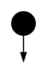
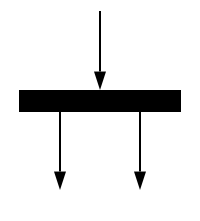

<style>
img[alt~="center"] {
    display: block;
    margin: 0 auto;
}
</style>

<!-- _paginate: false -->
# **Engenharia de Software**

## Capítulo 4 - Modelos

---

## Livro-texto

Slides baseados no conteúdo do livro **Engenharia de Software Moderna** de Marco Tulio Valente
ISBN: 978-65-00-01950-6
Site: https://engsoftmoderna.info

---

## Modelos de Software

- Modelos são criados para ajudar no entendimento e análise de um sistema
- São usados para comunicação entre desenvolvedores (são escritos por e para DEVs)
- São mais detalhados do que requisitos, mas ainda menos complexos do que o código fonte (documentos de requisitos são para usuários finais)

---

## Modelos de Software

- São menos efetivos do que os modelos matemáticos usados em outras engenharias
  - Ao abstrair detalhes, também descartam parte da complexidade que é essencial aos sistemas modelados

---

## UML (Unified Modelling Language)

- Notação gráfica para modelagem de software
- Linguagem que define um conjunto de diagramas para documentar e ajudar no design de sistemas de software

---

## Como Usar a UML

- **UML como blueprint**
  - Após levantamento de requisitos, produzir um conjunto de modelos, documentando diversos aspectos de um sistema
  - Recomendado quando se emprega processos de desenvolvimento do tipo Waterfall ou Processo Unificado (UP)
- **UML como linguagem de programação**
    - Geração automática de código a partir de modelos UML
    - Desenvolvimento Dirigido por Modelos (MDD)

---

## Como Usar a UML

- **UML como esboço**
  - Construir diagramas leves e informais de partes de um sistema
  - Usados para comunicação entre desenvolvedores em duas situações:
    - Engenharia Avante (Forward Engineering)
    - Engenharia Reversa (Reverse Engineering)

---

## Engenharia Avante (Forward Engineering)

- Usam-se modelos UML para discutir e analisar alternativas de design, antes que exista qualquer código
- Exemplo: esboço das principais classes que deverão ser criadas no sistema, bem como dos relacionamentos entre elas

---

## Engenharia Reversa (Reverse Engineering)

- Usam-se para analisar e discutir uma funcionalidade que já se encontra implementada no código fonte
- Exemplo: para explicar para um desenvolvedor recém-contratado como uma funcionalidade está implementada

---

## Diagramas UML

- Diagramas Estáticos (ou Estruturais)
  - Modelam a estrutura de um sistema
  - Exemplo: Diagramas de Classes e Diagramas de Pacotes
- Diagramas Dinâmicos (ou Comportamentais)
  - Modelam eventos que ocorrem durante a execução de um sistema
  - Exemplo: Diagramas de Sequência e Diagramas de Atividades
- Se for modelar a estrutura de um programa, utilize diagramas estáticos; se for comportamento, utilize diagramas dinâmicos

---

## Diagramas de Classe

- Oferecem uma representação gráfica para um conjunto de classes, provendo informações sobre atributos, métodos e relacionamentos que existem entre as classes modeladas
- Tipos de relacionamentos: **associação**, **herança** e **dependência**


---

## Associações do Diagrama de Classes

- Quando uma classe `A` possui um atributo `b` de um tipo `B`, dizemos que existe uma associação de `A` para `B`, a qual é representada por meio de uma seta de `A`para `B`


---

## Associações do Diagrama de Classes

- Código da associação

```java
class A {
    ...
    private B b;
    ...
}

class B {
    ...
}
```

---

## Associações do Diagrama de Classes

- O objetivo é deixar claro o atributo pertence a `Pessoa`, mas ele "aponta" para um objeto do tipo `Fone`


---

## Associações do Diagrama de Classes

```java
class Pessoa {
    // Não pode ser null
    private Fone fone;
}

class Fone {
    ...
}
```

---

## Multiplicidade em Associações

- Associações incluem informações de **multiplicidade**, que indicam quantos objetos podem estar associados ao atributo responsável pela associação
- As multiplicidades mais comuns são 1 (exatamente um objeto), 0..1 (zero ou um objeto) e * (zero ou mais objetos)

---

## Multiplicidade em Associações


---

## Multiplicidade em Associações

```java
class Pessoa {
    // Pode ser null
    private Fone fone;
}

class Fone {
    ...
}
```

---

## Multiplicidade em Associações


---

## Multiplicidade em Associações

```java
class Pessoa {
    private Fone[] fone;
    ...
}

class Fone {
    ...
}
```

---

## Associação Bidirecional


---

## Associação Bidirecional

```java
class Pessoa {
    ...
    private Fone fone;
    ...
}

class Fone {
    ...
    private Pessoa[] dono;
    ...
}
```

---

## Herança

- São representadas por meio de setas com a extremidade não preenchida

---

## Herança


---

## Dependência

- Representada por uma linha tracejada de `A` para `B`, quando class `A` usa a classe `B`, porém esse uso não ocorre por meio de associação ou herança
- Exemplo:
  - Método de `A` declara um parâmetro ou variável local do tipo `B`
  - Método de `A` lança uma exceção do tipo `B`

---

## Dependência


---

## Dependência

```java
import java.util.Stack;

class MinhaClasse {
    ...
    private void metodoX() {
        Stack stack = new Stack();
        ...
    }
    ...
}
```

---

## Diagrama de Pacotes

- São recomendados quando se pretende oferecer um modelo de mais alto nível de um sistema, que mostre apenas grupos de classes (pacotes) e as dependências entre eles
- Figura em forma de pasta de arquivos
- Observações:
  - Dependências não incluem informações sobre quantas classes do pacote de origem dependem de classes do pacote de destino
  - Em diagramas de pacotes, temos um único tipo de seta, sempre tracejada, que representa qualquer tipo de relacionamento

---

## Diagrama de Pacotes


---

## Diagramas de Sequência

- São diagramas dinâmicos, também chamados de comportamentais
- Modelam objetos de um sistema, ao invés de classes
- São usados quando se pretende explicar o comportamento de um sistema, em um determinado cenário

---

## Diagramas de Sequência


---

## Diagramas de Sequência

```java
class A {
    void g() {
        ...
    }
    void f() {
        ...
        g();
        ...
    }
    main() {
        A a = new A();
        a.f();
    }
}
```

---

## Diagramas de Sequência


---

## Diagramas de Atividades

- São usados para representar, em alto nível, um processo ou fluxo de execução
- As **ações** são representadas por retângulos
- Elementos de **controle** definem a ordem de execução das ações

---

## Diagramas de Atividades


---

## Diagramas de Atividades

- **Nodo Inicial**: Dá início à execução do processo



---

## Diagramas de Atividades

- **Ações**: Possui um único fluxo de entrada e um único fluxo de saída


---

## Diagramas de Atividades

- **Decisões:** Possui um único fluxo de entrada e dois ou mais de saída. Cada fluxo de saída possui uma variável booleana associada, chamada de guarda


---

## Diagramas de Atividades

- **Merges**: Possui vários fluxos de entrada mas um único de saída. São usados para unir os fluxos de nodos de decisão


---

## Diagramas de Atividades

- **Forks**: Possuem um único fluxo de entrada e um ou mais fluxos de saída. Representam múltiplos processos em execução de forma paralela



---

## Diagramas de Atividades

- **Joins**: Possuem vários fluxos de entrada, mas um único fluxo de saída. São usados para sincronizar processos, transformando vários fluxos de execução em um único fluxo


---

## Diagramas de Atividades

- **Nodo Final**: Encerra a execução do diagrama de atividades


