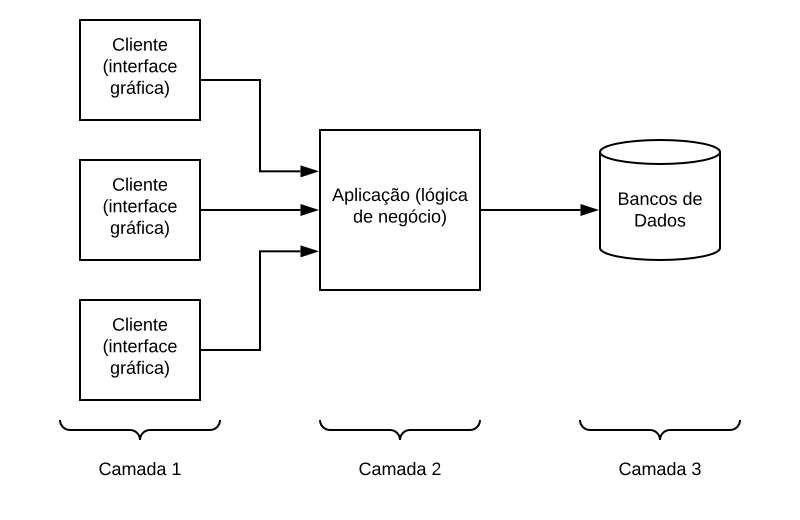
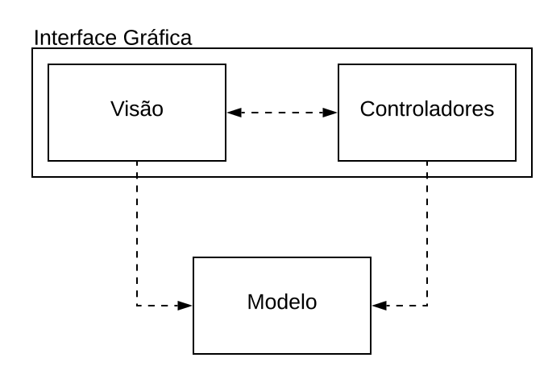
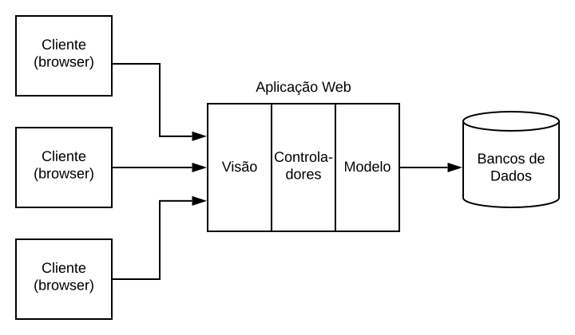
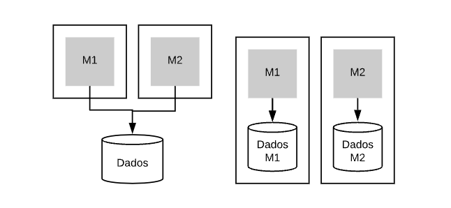
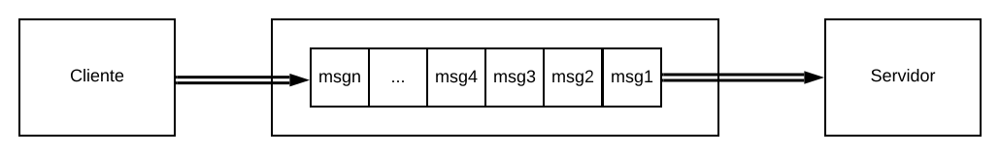
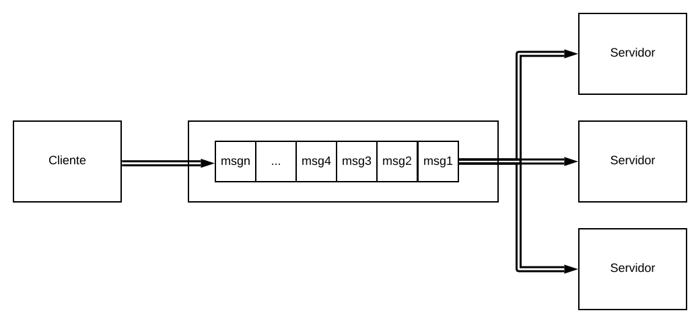
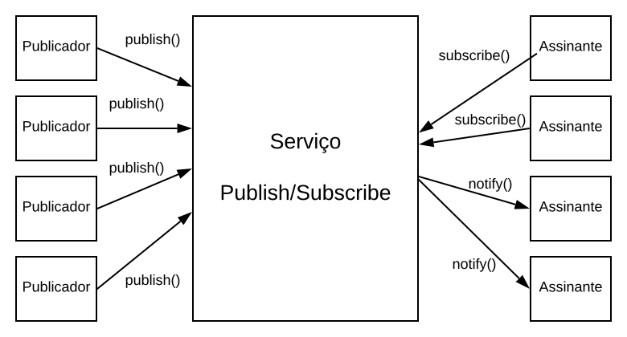
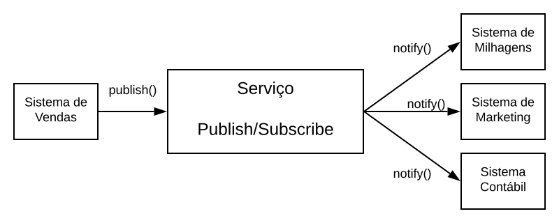
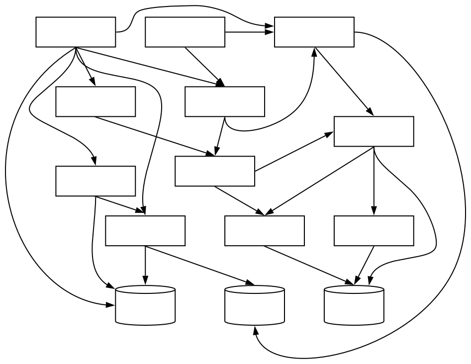

<style>
img[alt~="center"] {
    display: block;
    margin: 0 auto;
}
</style>

<!-- _paginate: false -->
# **Engenharia de Software**

## Capítulo 7 - Arquitetura

---

## Livro-texto
Slides baseados no conteúdo do livro **Engenharia de Software Moderna** de Marco Tulio Valente
ISBN: 978-65-00-01950-6
Site: https://engsoftmoderna.info

---

## Introdução

- Arquitetura
  - Preocupa-se com "projeto em mais alto nível", com foco em pacotes, módulos, subsistemas, camadas ou serviços
  - Os componentes devem ser relevantes para que um sistema atenda a seus objetivos
  - É um conjunto de decisões, dentre elas inclui-se a definição dos módulos principais de um sistema

---

## Introdução

- **Padrões arquiteturais** propõe uma organização de mais alto nível para sistemas de software, incluindo seus principais módulos e as relações entre eles
- Estudar os padrões arquiteturais das seguintes arquiteturas
  - Arquitetura em Camadas
  - Arquitetura Model-View-Controller (MVC)
  - Microsserviços
  - Arquitetura Orientada a Mensagens
  - Arquitetura Publish/Subscribe

---

## Arquitetura em Camadas

- As classes são organizadas em módulos de maior tamanho, chamados de camadas
- As camadas estão dispostas de forma hierárquica, como em um bolo
- Particiona a complexidade envolvida no desenvolvimento de um sistema em componentes menores (as camadas)
- Uma camada só pode usar *serviços* da camada imediatamente inferior
- São muito utilizadas na implementação de protocolos de rede

---

## Arquitetura em Três Camadas

- Interface com o Usuário (Apresentação): responsável por toda interação com o usuário. Exemplo: aplicação desktop (GUI) ou web
- Lógica de Negócio (Aplicação): implementa as regras de negócio do sistema. Exemplo: enviar um e-mail quando lançar uma nota
- Banco de Dados: armazena os dados manipulados pelo sistema. Exemplo: salvar as notas em um banco de dados

---

## Arquitetura em Três Camadas



---

## Arquitetura em Três Camadas

- Normalmente, a arquitetura em três camadas é distribuída
  - A camada de interface executa na máquina dos clientes
  - A camada de negócio (camada de aplicação) executa em um servidor (servidor de aplicação)
    - Pode ter diversos módulos como uma fachada, módulo de persistência, etc.
  - Um banco de dados

---

## Arquitetura MVC (Model-View-Controller)

- Organizam as classes de um sistema em três grupos:
  - Visão: classes responsáveis pela apresentaçãop da interface gráfica do sistema, incluindo janelas, botões, menus, etc.
  - Controladoras: classes que tratam e interpretam eventos gerados por dispositivos de entrada. Podem solicitar alteração no estado do Modelo ou Visão
  - Modelo: classes que armazenam os dados manipulados pela aplicação e que têm a ver com o domínio do sistema


---

## Arquitetura MVC (Model-View-Controller)



---

## Arquitetura MVC (Model-View-Controller)

- Vantagens:
  - Favore a especialização do trabalho de desenvolvimento, pois pode-se ter desenvolvedores especialistas em interfaces gráficas (front-end)
  - Permite que classes de Modelo sejam usadas por diferentes Visões
  - Favorece testabilidade, ao separar objetos de apresentação de objetos de Modelo

---

## Arquitetura MVC (Model-View-Controller)

- MVC: Smalltalk-80; Web: três camadas



---

## Single Page Applications (SPA)

- Aplicações web são menos interativas e responsivas, devido ao atraso da comunicação entre navegador e servidor web
- São mais parecidas com aplicações desktop do que aplicações Web tradicionais

---

## Single Page Applications (SPA)

```html
<html>
<script src="https://cdn.jsdelivr.net/npm/vue"></script>
<body>
<h3>Uma Simples SPA</h3>
<div id="ui">
  Temperatura: {{ temperatura }}
  <p><button v-on:click="incTemperatura">Incrementa</button></p>
</div>
<script>
var model = new Vue({
  el: '#ui',
  data: {
    temperatura: 60
  },
  methods: {
    incTemperatura: function() {
      this.temperatura++;
    }
  }
})
</script>
</body>
</html>
```

---

## Microsserviços

- São um instrumento para garantir que times de desenvolvimento somente usem interfaces públicas de outros sistemas
  - Quando os módulos são separados em processos distintos não há mais possibilidade de que um módulo acesse um recurso interno de outro módulo, como uma variável global, um atributo estático ou uma interface interna
- Outra vantagem é a escalabilidade, pois só é preciso instanciar o serviço que precisa ser escalado e não toda a aplicação (escalabilidade horizontal)

---

## Microsserviços

-  São autônomos e independentes, podendo ser implementados em tecnologias diferentes, incluindo linguagens, de programação, frameworks e bancos de dados
-  Podem ter falhas parciais, pois um microsserviço pode não afetar outros. Exemplo: microsserviço de recomendação de compras
-  Só tornaram-se possíveis devido ao aparecimento de plataformas de computação em nuvem

---

## Microsserviços

- Devem ser autônomos também do ponto de vista de dados, devendo gerenciar os dados de que precisam para prover o seu serviço
  - Um único banco de dados por se transformar em um gargalo à evolução do sistema



---

## Microsserviços

- Quando não usar?
  - Complexidade: DEVs têm de utilizar um conjunto de tecnologias em redes para comunicação (HTTP/REST)
  - Latência: a comunicação entre microsserviços envolve um atraso maior
  - Transações Distribuídas: garantir que operações que operam em dois ou mais banco de dados sejam atômicas, isto é, executam com sucesso ou falham

---

## Arquiteturas Orientadas a Mensagens

- A comunicação entre clientes e servidores é mediada por um terceiro serviço que tem a única função de prover uma fila de mensagens (brokers)
- Os clientes atuam como produtores de informações (inserem mensagens na fila) e o servidores como consumidores (retiram da fila e processam a informação)
- Permitem comunicação assíncrona entre clientes e servidores e duas formas de desacoplamento: **no espaço** (clientes não precisam conhecer os servidores e vice-versa) e **no tempo** (não precisam estar simultaneamente disponíveis para se comunicar)

---

## Arquiteturas Orientadas a Mensagens




---

## Arquiteturas Orientadas a Mensagens

- Exemplo: empresa de telecomunicações
  - Pode usar uma fila de mensagens para mediar a comunicação entre o sistema de vendas e o sistema de engenharia. O sistema de vendas irá depositar uma mensagem na fila de mensagens, com informações do pacote. Cabe ao sistema de enhgenharia ler essa mensagem e ativar o serviço que foi vendido

---

## Arquiteturas Publish/Subscribe

- As mensagens são chamadas de eventos
- Os componentes da arquitetura são chamados de publicadores (*publishers*) e assinantes (*subscribers*) de eventos
- Publicadores produzem eventos e os publicam no serviço de publish/subscribe. Quando um evento é publicado, seus assinantes (que assinaram previamente) são notificados
- Às vezes chamada de **arquiteturas orientadas a eventos**
- O serviço Pub/Sub também, às vezes, é chamado de **broker de eventos**

---

## Arquiteturas Publish/Subscribe



---

## Arquiteturas Publish/Subscribe

- Diferenças entre publish/subscribe e sistemas baseados em filas de mensagens:
  - Pub/Sub tem um estilo de comunicação de 1:n (**comunicação em grupo**)
  - Fila de mensagens a comunicação é 1:1 (**comunicação ponto-a-ponto**)
  - Em Pub/Sub os assinantes são notificados assincronamente
  - Em uma fila de mensagens, os servidores (consumidores) têm de puxar (pull) as mensagens da fila

---

## Arquiteturas Publish/Subscribe

- Diferença entre Pub/Sub para o padrão Observer:
  - Pub/Sub é uma solução para sistemas distribuídos
  - Observer não foi proposto no contexto de arquiteturas distribuídas

---

## Arquiteturas Publish/Subscribe

- Exemplo: Companhia Aérea
  - O evento "venda" será então assinado por três sistemas da companhia aérea
  - (1) sistema de milhagens, pois as milhas relativas à passagem devem ser creditadas na conta do passageiro
  - (2) sistema de marketing, que pode usar os dados da venda para fazer ofertas para o cliente, como aluguel de carros
  - (3) sistema de contabilidade, pois a venda que foi realizada precisa ser incluída na contabilidade da empresa

---

## Arquiteturas Publish/Subscribe



---

## Outros Padrões Arquiteturais

- **Pipes e Filtros**: arquitetura orientada a dados, na qual os programas (filtros) t6Ecm como função processar os dados recebidos na entrada e gerar uma nosa saída. Os filtros são conectados por meio dos pipes, que agem como buffers. Exemplo: comandos do sistema unix: `ls | grep csv | sort`
- **Cliente/Servidor**: arquitetura muito usada na implementação de serviços básicos de rede. Exemplo: serviço de impressão, arquivos e web
- **Peer-to-peer**: arquiteturas distribuídas nas quais os módulos de aplicação são cliente e servidor. Exemplo: BitTorrent

---

## Anti-padrões Arquiteturais

- Big ball of mud (grande bolsa de lama): descreve sistemas nos quais qualquer módulo comunica-se com praticamente qualquer outro módulo
  - Explosão de dependências
  - Manutenção muito difícil e arriscada




